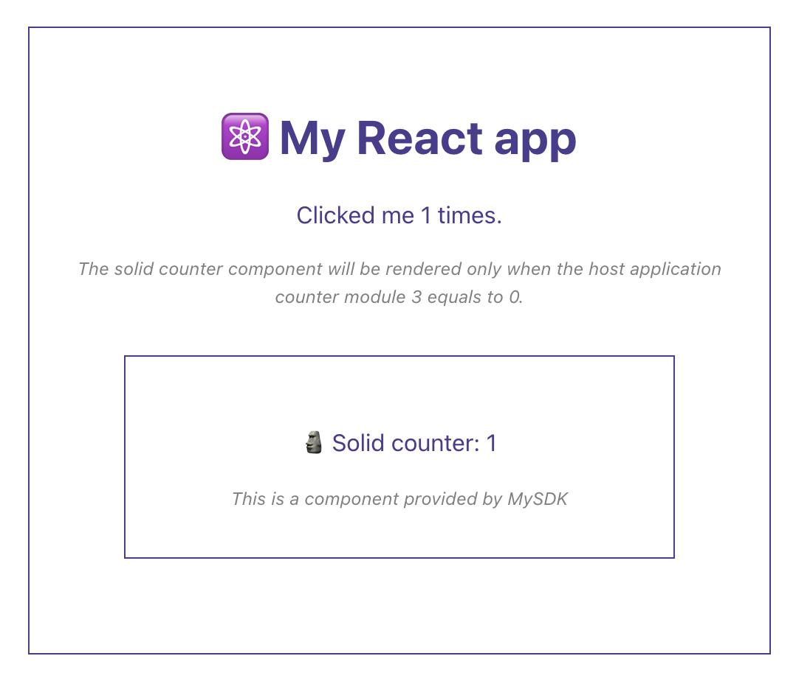
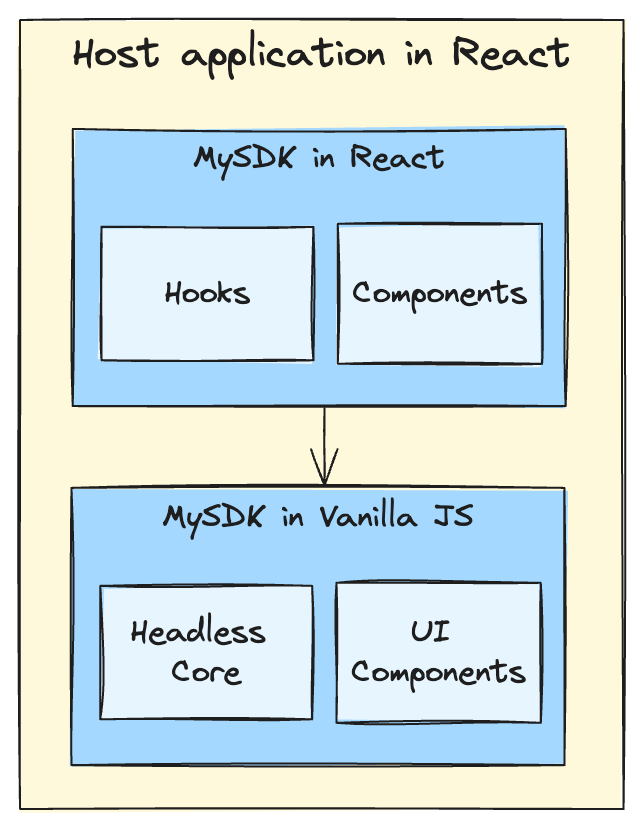

# Solid Components POC

A Vanilla JS SDK with components and a thin, framework specific wrapper in React.

## Architecture

1. A host react application
3. A Vanilla JS SDK containg UI components built in SolidJS
2. A React SDK exposing Vanilla JS SDK in react lingo

> [!NOTE]
> To avoid using a monorepo, TSX files use the `.react` or `.solid` extension to instruct Vite about JSX parsing.
> The `.react` files are using the Vite React JSX plugin, the `.solid` files are using the Vite Solid JSX plugin.

## Available Scripts

In the project directory, you can run:

### `npm run dev` or `npm start`

Runs the app in the development mode. 
Open [http://localhost:3000](http://localhost:3000) to view it in the browser.

The page will reload if you make edits. 

### `npm run build`

Builds the app for production to the `dist` folder. 
It correctly bundles Solid in production mode and optimizes the build for the best performance.

The build is minified and the filenames include the hashes. 
Your app is ready to be deployed!

## Deployment

You can deploy the `dist` folder to any static host provider (netlify, surge, now, etc.)
